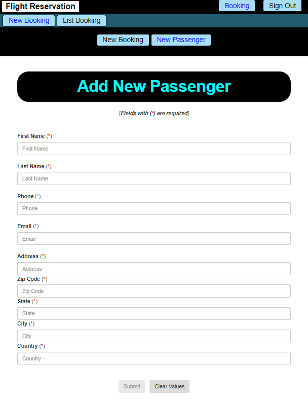

# Airline Reservation

---

## Aim
Building a project based on an EER (Enhanced Entity-Relationship). The whole 3-Tier Architecture is done!

---------------

## Enhanced Entity-Relationship

---------------

## User Interface (data is generated randomly: fake address, fake date, etc.)

### List All Bookings

### List All Passengers

### Add New Passenger

---------------

## Execution

> 1 - Create a database name 'airline_reservation'
> 2 - Execute (on the application's root folder): **npm install** (to install **dependencies**)
> 3 - Execute (on the application's root folder): **npm run build** (to run the **server**)
> 4 - Open your web browser (Firefox, Chrome, etc.) then, enter: **localhost:3000**

---------------

## Configuration (VERY IMPORTANT)

At the project's root folder, we have a file name "**server.js**", by the end, we have:

It's very important to follow the instruction, otherwise, you could have very disappointed surprises ...

---------------

## Author
* Dinh HUYNH - All Rights Reserved!
* dinh.hu19@yahoo.com