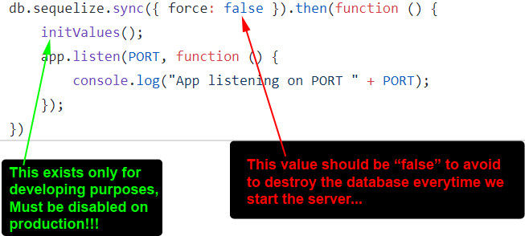

# Airline Reservation

## Aim
>  * Complexe management to allow to book airplane's ticket.
>  * **Transaction** is used to ensure that if the WHOLE processus (**insert**, **update** and **delete**) is NOT successful then NOTHING will be done (**Rollback** function will take care of it).
>  * The **insertion** of a **booking** is very complex:
>   - request information from all **collection**
>   - setup a very complex **formular** to get data in some order
>   - insertion - using **transaction** - to be sure that the insertion is successful for the WHOLE processus

---------------

## Technologies
> * **Front End**: ***React-Redux***
> * **Back End**: ***Express/Node.js*** + ***Sequelize*** (ORM)
> * **Database**: ***mySQL***

---------------

## Enhanced Entity-Relationship

---------------

## User Interface (data is generated randomly: fake address, fake date, etc.)

### List All Bookings

### List All Passengers

### Add New Passenger

---------------

## Execution

> 1 - Create a database name '**airline_reservation**' (enter the password of **YOUR** database. Instruction in this file [here](https://github.com/DinhLeGaulois2/sql_react_redux_airline_reservation/blob/master/server/models/index.js)). 
> 2 - Execute (on the application's **root** folder): **npm install** (to install **dependencies**) 
> 3 - Execute (on the application's **root** folder): **npm run build** (to run the **server**) 
> 4 - Open your web browser (***Firefox***, ***Chrome***, etc.) then, enter: **localhost:3000** 

---------------

## Configuration (VERY IMPORTANT)

At the project's root folder ([here](https://github.com/DinhLeGaulois2/sql_react_redux_airline_reservation/blob/master/server.js)), we have a file name "**server.js**", by the end, we have:

It's very important to follow the instruction, otherwise, you could have very disappointed surprises ...

---------------

## Author
* Dinh HUYNH - All Rights Reserved!
* dinh.hu19@yahoo.com